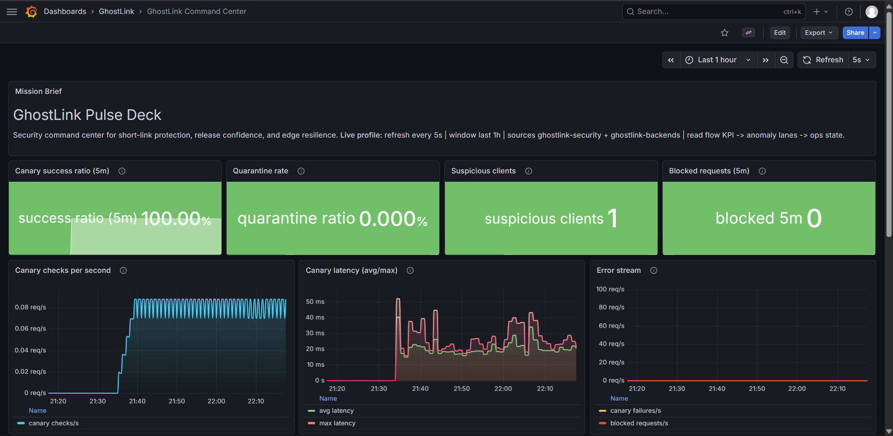
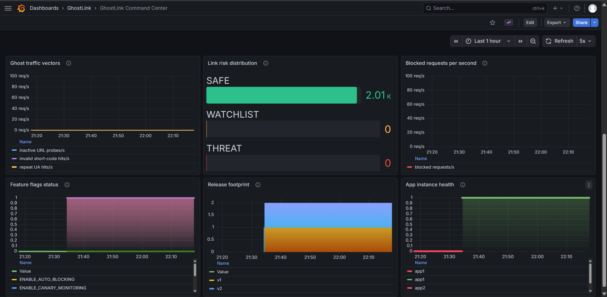

# GhostLink

A URL shortener built for the MLH Production Engineering Hackathon 2026.

GhostLink shortens URLs, tracks redirect events, scores link risk, and monitors link health. It runs behind Nginx with two app replicas, exposes Prometheus metrics, and ships with Grafana dashboards and Alertmanager rules.

**Stack:** Flask · Peewee ORM · PostgreSQL · Redis · Nginx · Prometheus · Grafana · Docker Compose · uv

**Team:** Sentinals

---

## Video

[](https://www.youtube.com/watch?v=03rN9cy9-sw)

---

## Dashboard






---

## What it does

- Shorten URLs with auto-generated or custom short codes
- Redirect users via `GET /{short_code}`
- Track click events with referrer and user attribution
- Score link risk based on five signals (dead destination, ghost probes, suspicious clients, canary failures, threat patterns)
- Quarantine high-risk short codes via Nginx without taking the app down
- Expose Prometheus metrics at `GET /metrics`
- Report health status at `GET /health`

---

## Prerequisites

- [uv](https://docs.astral.sh/uv/getting-started/installation/) — Python package manager
- PostgreSQL running locally or via Docker
- Redis running locally or via Docker (optional — app works without it)
- Docker + Docker Compose (for the full production stack)

---

## Quick Start (local)

```bash
# 1. Clone the repo
git clone https://github.com/stealthwhizz/MLH-PE-Hackathon-Sentinals.git
cd MLH-PE-Hackathon-Sentinals

# 2. Install dependencies
uv sync

# 3. Create the database
createdb hackathon_db

# 4. Configure environment
cp .env.example .env   # edit if your DB credentials differ

# 5. Run the server
uv run run.py

# 6. Verify
curl http://localhost:5000/health
# → {"db": "ok", "redis": "unavailable", "status": "ok"}
```

Tables are created automatically on startup. No migration step needed.

---

## Quick Start (Docker)

```bash
# Start the full stack: Nginx + 2 app replicas + Postgres + Redis + Prometheus + Grafana
docker compose up

# Verify
curl http://localhost/health
```

---

## Environment Variables

| Variable | Default | Description |
|---|---|---|
| `DATABASE_NAME` | `hackathon_db` | Postgres database name |
| `DATABASE_HOST` | `localhost` | Postgres host |
| `DATABASE_PORT` | `5432` | Postgres port |
| `DATABASE_USER` | `postgres` | Postgres user |
| `DATABASE_PASSWORD` | `postgres` | Postgres password |
| `REDIS_URL` | `redis://localhost:6379/0` | Redis connection URL |

### Release Metadata

| Variable | Default | Description |
|---|---|---|
| `APP_VERSION` | `v1-dev` | Release version used in health and response headers |
| `GIT_SHA` | `local` | Source revision identifier |
| `DEPLOYED_AT` | `unknown` | Deployment timestamp (UTC ISO8601 recommended) |
| `RELEASE_OWNER` | `platform` | Release owner / on-call engineer |
| `RELEASE_NOTES_URL` | `` | Link to release notes |

### Feature Flags

Truthy values accepted for all flags: `true`, `1`, `yes`, `on` (case-insensitive).

| Variable | Default | Description |
|---|---|---|
| `ENABLE_QUARANTINE_MODE` | `true` | Enables quarantine enforcement during redirects |
| `ENABLE_RISK_SCORING` | `true` | Enables risk-score computation paths |
| `ENABLE_GHOST_PROBE_ALERTS` | `true` | Enables suspicious-client and probe telemetry |
| `ENABLE_CANARY_MONITORING` | `true` | Enables canary state ingestion and metrics |
| `ENABLE_AUTO_BLOCKING` | `false` | Reserved for automated defensive blocking logic |
| `ENABLE_THREAT_HEATMAP` | `false` | Reserved for heatmap-focused analytics exposure |

### Rollback State

| Variable | Default | Description |
|---|---|---|
| `ROLLBACK_STATE_FILE` | `/var/lib/ghostlink-security/rollback_state.env` | Shared rollback/recovery state consumed by metrics |

---

## API Endpoints

Endpoint request and response templates use the same style in [docs/API_REFERENCE.md](docs/API_REFERENCE.md): Request Example, Success Response, and Error Responses.

### Health
| Method | Path | Description |
|---|---|---|
| `GET` | `/health` | Returns DB/Redis status plus release metadata and feature flags |
| `GET` | `/metrics` | Prometheus metrics |
| `GET` | `/health-demo`, `/promo-demo`, `/checkout-demo`, `/dashboard-demo`, `/support-demo` | Synthetic canary health routes |

### URLs
| Method | Path | Description |
|---|---|---|
| `POST` | `/shorten` | Create short URL with compact response payload |
| `POST` | `/urls` | Create a short URL |
| `GET` | `/urls` | List all URLs (supports `?user_id=1&is_active=true`) |
| `GET` | `/urls/{id}` | Get a URL by ID |
| `PATCH`, `PUT` | `/urls/{id}` | Update mutable URL fields |
| `DELETE` | `/urls/{id}` | Soft delete a URL |
| `GET` | `/urls/{id}/risk` | Get risk score details for URL |
| `GET` | `/{short_code}` | Redirect to original URL |
| `GET` | `/r/{short_code}` | Redirect alias |
| `GET` | `/urls/{short_code}` | Redirect alias |

### Users
| Method | Path | Description |
|---|---|---|
| `POST` | `/users` | Create a user |
| `GET` | `/users` | List all users (supports `?page=1&per_page=10`) |
| `GET` | `/users/{id}` | Get a user by ID |
| `PATCH`, `PUT` | `/users/{id}` | Update a user |
| `DELETE` | `/users/{id}` | Delete a user |
| `POST` | `/users/bulk` | Bulk import from CSV |

### Events
| Method | Path | Description |
|---|---|---|
| `POST` | `/events` | Create an event |
| `GET` | `/events` | List events (supports `?url_id=1&user_id=1&event_type=click`) |

Full request and response shapes are documented in [docs/API_REFERENCE.md](docs/API_REFERENCE.md).

---

## Seed Data

CSV files are in `data/`. Load them via the bulk endpoint or the seed script:

```bash
# Via seed script
uv run scripts/seed.py

# Via API
curl -X POST http://localhost:5000/users/bulk \
  -H "Content-Type: application/json" \
  -d '{"file": "users.csv", "row_count": 400}'
```

---

## Running Tests

```bash
# Run all tests
uv run pytest app/tests/

# Run with coverage
uv run pytest --cov=app --cov-report=term app/tests/

# Run unit tests only
uv run pytest app/tests/test_unit.py -v
```

CI runs the full suite on every push to `main` via GitHub Actions.

---

## Rollback Automation

```bash
make rollback-plan-app1
make rollback-plan-app2
make rollback-plan-all

# Execute rollback after preview
make rollback-app1
make rollback-app2
make rollback-all
```

Use the `rollback-plan-*` targets first to preview exact compose/state changes without mutating files or restarting containers.

All targets call `scripts/rollback.sh`, which updates release version env state, restarts services, waits for healthy status, and records rollback telemetry.

Post-rollback checks:

- `curl -i http://localhost/health` and verify `X-GhostLink-Version` header
- verify health payload includes expected `version` and `git_sha`
- verify recovery metrics in `/metrics`:
  - `ghostlink_rollbacks_total`
  - `ghostlink_recovery_attempts_total`
  - `ghostlink_recovery_success_total`

---

## Project Structure

```
MLH-PE-Hackathon-Sentinals/
├── app/
│   ├── __init__.py              # App factory, table creation on startup
│   ├── database.py              # DB + Redis connection management
│   ├── models/
│   │   ├── user.py
│   │   ├── url.py
│   │   ├── event.py
│   │   ├── health_check.py
│   │   ├── risk_score.py
│   │   └── request_fingerprint.py
│   ├── routes/
│   │   ├── users.py
│   │   ├── urls.py
│   │   ├── events.py
│   │   └── health.py
│   ├── services/
│   │   ├── cache.py             # Redis caching with TTL
│   │   ├── shortener.py         # Short code generation
│   │   ├── risk_scorer.py       # 5-signal risk scoring
│   │   ├── link_health.py       # Background health checker
│   │   └── security.py          # Quarantine and fingerprinting
│   └── tests/
│       ├── conftest.py
│       ├── test_unit.py
│       ├── test_integration.py
│       └── test_api_compat.py
├── data/
│   ├── users.csv
│   ├── urls.csv
│   └── events.csv
├── docs/
│   ├── API_REFERENCE.md
│   ├── ARCHITECTURE.md
│   ├── CAPACITY.md
│   ├── FAILURE_EDGE_CASES.md
│   └── RUNBOOK.md
├── nginx/nginx.conf             # Nginx with round-robin upstream + quarantine
├── prometheus/
│   ├── prometheus.yml
│   └── alert_rules.yml
├── alertmanager/alertmanager.yml
├── grafana/dashboards/ghostlink.json
├── k6/load_test.js              # Load test: 50 / 200 / 500 concurrent users
├── scripts/
│   ├── seed.py
│   └── setup_db.py
├── DECISIONS.md                 # Architecture decision log
├── docker-compose.yml
├── run.py
└── pyproject.toml
```

---

## Documentation

| Document | Description |
|---|---|
| [docs/API_REFERENCE.md](docs/API_REFERENCE.md) | All endpoints, request/response shapes, error codes |
| [docs/ARCHITECTURE.md](docs/ARCHITECTURE.md) | System design and component diagram |
| [docs/RUNBOOK.md](docs/RUNBOOK.md) | On-call runbook for each alert type |
| [docs/CAPACITY.md](docs/CAPACITY.md) | Load tiers, scaling signals, and saturation thresholds |
| [docs/FAILURE_EDGE_CASES.md](docs/FAILURE_EDGE_CASES.md) | Error handling for every endpoint and dependency |
| [docs/SECURITY_DRIFT_REPORT.md](docs/SECURITY_DRIFT_REPORT.md) | Security baseline checks and drift detection report |
| [DECISIONS.md](DECISIONS.md) | Key architectural decisions and rationale |
